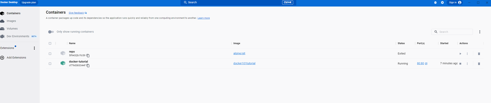

# 001_ready
## Basis-Installation für die Softwareentwicklung und Tool-Empfehlungen

- [ ] [Install IntelliJ IDEA](https://www.jetbrains.com/de-de/idea/download/#section=windows) -  IntelliJ IDEA Ultimate herunterladen

- [ ] [GitHub](https://github.com/signup?ref_cta=Sign+up&ref_loc=header+logged+out&ref_page=%2F&source=header-home) -  GitHub account erstellen

- [ ] [Git Bash](https://gitforwindows.org/) -  Git Bash installieren

- [ ]  Einen neuen SSH-Schlüssel erzeugen

**ssh-keygen -t ed25519 -C "DEINE@EMAIL.DE"**
> Falls dein System dafür zu alt ist:
> ssh-keygen -t rsa -b 4096 -C ""DEINE@EMAIL.DE"

- [ ]  Einen neuen SSH-Schlüssel zum GitHub-Konto hinzufügen

- [ ] Ein Repositorys forken  

  

- [ ] Ein Repository klonen  

git clone https://github.com/arena-challenges/001_ready.git

Sie sollen die Adresse Ihres Repositorys angeben.

  

oder

- [ ] Vorbereiten des Windows-Betriebssystems für die Docker-Installation.

Für Enterprise- und Pro-Versionen von Windows wird die Virtualisierung basierend auf dem Hyper-V-Hypervisor konfiguriert.

Denken Sie daran, das System neu zu starten, damit die Änderungen wirksam werden.

- [ ] [Docker](https://www.docker.com/products/docker-desktop/) - Docker Desktop herunterladen

und installieren

Docker Desktop starten

